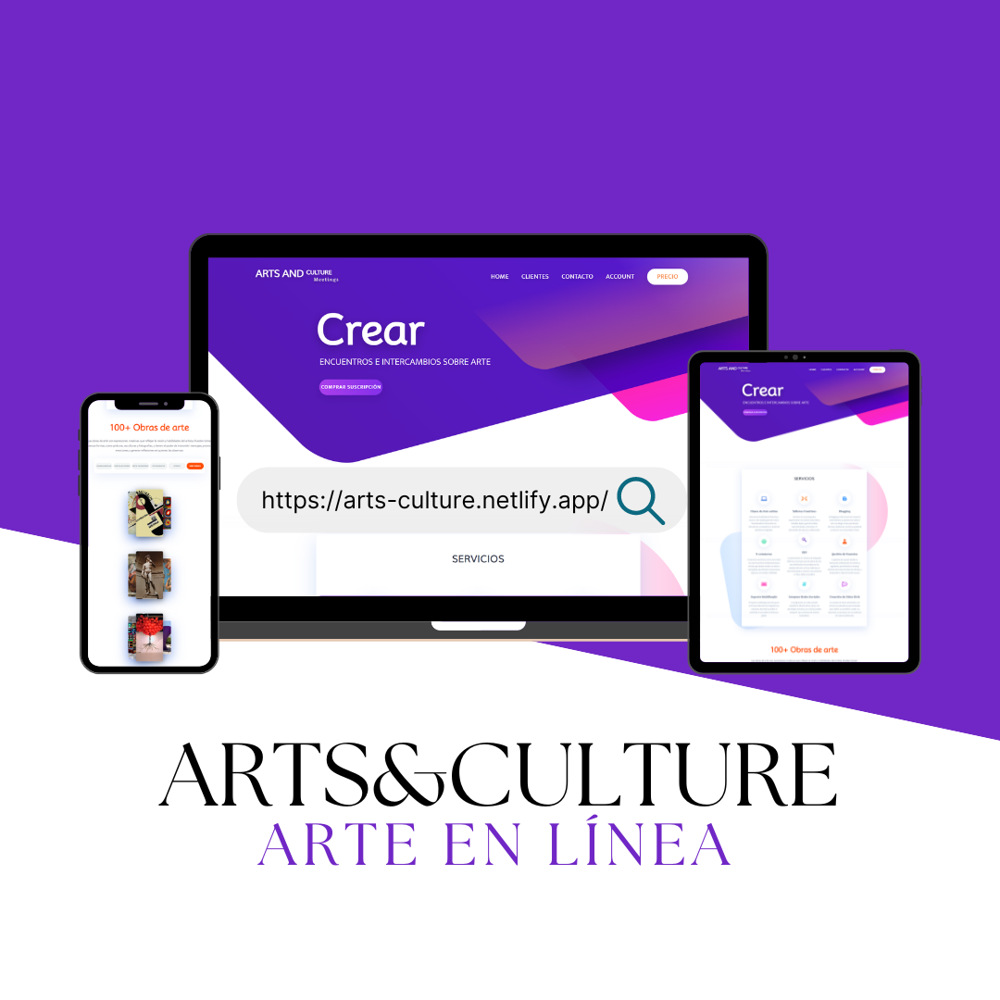

# Proyecto - Arts and Culture
***
## Proyecto final del módulo Frontend del curso Fullstack Node.js, CAC.💻
***
### Este proyecto tiene como objetivo principal mostrar como ejemplo del desarrollo web de una página.
### El diseño intenta atraer la atención del usuario, para lo cual se utiliza un contraste de colores Puros.[Colores](https://es.wikipedia.org/wiki/Johannes_Itten)
*****
### Dejo aquí el link del proyecto [Netlify](https://arts-culture.netlify.app/)
*****
### Para clonar está Repo seguí estos pasos en tu terminal:
- #### Ir al [Repo](https://github.com/Pame-85/Proyecto-Front-CAC-2024).
- #### Forkearlo.
- #### Ir a Code y copiar la URL.
- #### Abrir el Bash.
- #### Ingresar comando ```git clone < url>```.
- #### Posicionarse en la carpeta del proyecto y abrirlo con un IDE.
### Proyecto Responsive:

*****


### Integrantes: Pamela Fumagalli, Sommerling Mauricio Peña

